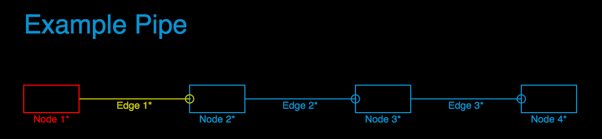

pipe-viz
========

Pipeline visualisation using processing.js

## Installation

Checkout or download the files in the repo.

    $ git clone https://github.com/zeroXten/pipe-viz.git
    $ cd pipe-viz

## Running it

Run something to serve the files. We're going to use the serve rubygem.

    $ serve
    Thin 1.6.2 available at http://0.0.0.0:4000
    Thin web server (v1.6.2 codename Doc Brown)
    Maximum connections set to 1024
    Listening on 0.0.0.0:4000, CTRL+C to stop

Go to the example visualisation in your browser:

    http://localhost:4000?path=example

See something like this:

## Configuring nodes and edges

The path=example translates to the example directory which contains two files:

  * elements.csv
  * status.csv

Basic parameters and the nodes and edges are definied in elements.csv:

    $ cat example/elements.csv
    title,Example Pipe
    color,8,146,208
    background,0,0,0
    node,node1,Node 1,0,0,100,50,http://www.google.com
    node,node2,Node 2,300,0,100,50,http://www.google.com
    node,node3,Node 3,600,0,100,50,http://www.google.com
    node,node4,Node 4,900,0,100,50,http://www.google.com
    edge,edge1,Edge 1,100,25,300,25,http://www.google.com
    edge,edge2,Edge 2,400,25,600,25,http://www.google.com
    edge,edge3,Edge 3,700,25,900,25,http://www.google.com

The meaning of each field depends on the type specified in the first element. There should be no spaces between commas and element values.

### title

Second element is the value of the title

### color

Default forground color. Fields are Red, Green, Blue

### background

Sets the background color. Fields are Red, Green, Blue

### node

Specifies a node. Fields are:

* unique id - must unique across nodes and edges
* label - any string that doesn't contain a comma
* x position as integer pixels (top left of node)
* y position as integer pixels (top left of node)
* width as integer pixels
* height as integer pixels
* url - optional. Can't contain commas

### edge

Specifies an edge. Fields are:

* unique id - must unique across nodes and edges
* label - any string that doesn't contain a comma
* starting x position as integer pixels
* starting y position as integer pixels
* final x position as integer pixels
* final y position as integer pixels
* url - optional. Can't contain commas

## Setting status

Pipe-viz has been designed to be generic. It doesn't try to impose any meaning, it just wants to draw colored boxes and lines.

So, the status.csv specifies a color for the relevant elements. If an element isn't specified, the color is set to the default color.

    $ cat example/status.csv
    node1,255,0,0
    edge1,200,200,0

The fields are:

* unique id - refers to one of the elements in elements.csv
* Red
* Green
* Blue

In this case we're setting node1 to red and edge1 to yellow.

How exactly something is added to the status.csv is up to you. You might want to run a bash script in a cron job that makes various curl calls to your monitoring platform.

## Adding more stuff

Just create a new directory in the folder with the elements.csv and status.csv file and call it with the ?path= param.
